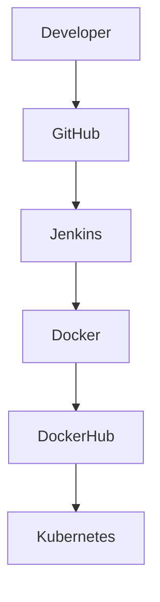

# Production Grade 3-Tier DevOps Project

## Overview

A production-grade 3-tier application built using React, Flask, and PostgreSQL. The project demonstrates modern DevOps practices including containerization, CI/CD automation, Kubernetes deployment, monitoring, and auto-scaling.

## Architecture

## Tech Stack

### Application

* React
* Flask
* PostgreSQL

### DevOps

* Docker
* Docker Compose
* Jenkins
* Kubernetes
* Prometheus
* Grafana
* Helm

## Key Features

* CI/CD Pipeline using Jenkins
* Containerized deployment with Docker
* Kubernetes orchestration and auto-scaling
* Monitoring with Prometheus and Grafana

## CI/CD Workflow

1. Code pushed to GitHub
2. Jenkins pipeline triggered
3. Docker image built and pushed
4. Kubernetes deploys application
5. Prometheus collects metrics
6. Grafana visualizes system health

## Future Improvements

* NGINX Ingress Controller
* HTTPS/TLS
* ELK Stack Logging
* ArgoCD
* AWS EKS
* Terraform

